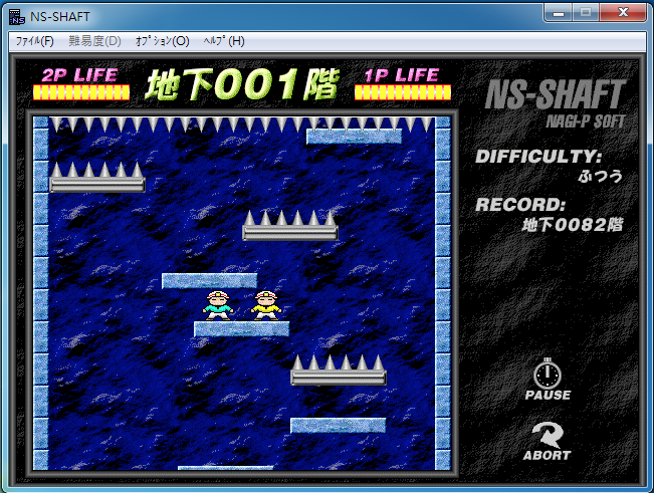

# Software Studio 2018 Spring Assignment 02 小朋友下樓梯

## 小朋友下樓梯
</img>

## Goal
1. **Fork the repo ,remove fork relationship and change project visibility to public.**
2. Complete a game "小朋友下樓梯" by Phaser. (JavaScript or TypeScript)
3. Your game should reach the basic requirements.
4. You can download needed materials from some open source webpage to beautify the appearance.
5. Commit to "your" project repository and deploy to Gitlab page.
6. **Report which items you have done and describing other functions or feature in REABME.md.**

## Scoring 
|                                              Item                                              | Score |
|:----------------------------------------------------------------------------------------------:|:-----:|
| A complete game process: start menu => game view => game over => quit or play again            |  25%  |
| Your game should follow the basic rules of  "小朋友下樓梯".                                    |  15%  |
|         All things in your game should have correct physical properties and behaviors.         |  15%  |
| Set up some interesting traps or special mechanisms. .(at least 2 different kinds of platform) |  15%  |
| Add some additional sound effects and UI to enrich your game.                                  |  10%  |
| Appearance (subjective)                                                                        |  10%  |
| Other creative features in your game (describe on README.md)                                   |  10%  |

## Reminder
* Do not make any change to our root project repository.
* Deploy your web page to Gitlab page, and ensure it works correctly.
    * **Your main page should be named as ```index.html```**
    * **URL should be : https://[studentID].gitlab.io/Assignment_02**
* You should also upload all source code to iLMS.
    * .html or .htm, .css, .js, .ts, etc.
    * source files
* **Deadline: 2018/05/24 23:59 (commit time)**
    * Delay will get 0 point (no reason)
    * Copy will get 0 point
    * "屍體" and 404 is not allowed
